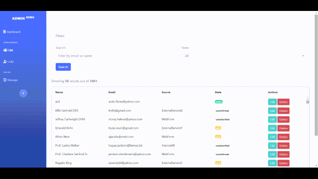

🎉 Alexandru's PHP/JS skills demo




### Arhitecture
Considering Subscribers information have multiple sources, a ```source``` column was added.

A basic implementation for key-set paging is used, instead of offset - limit as my asumption was that there may be millions of records.

This is complemented by infinite scroll in Ui - with virtualized items from ag-grid and basic filters (server side). State editing can be done stright from the listing, while adding fields can be achieved from the Edit page.

Fields can have a default value, based on their type, and the Ui will present the appropiate control. Form validation is done via Html5 capabilities in the Ui, and then again in the Api.

All endpoints repond in Json format, and try fo follow a REST-full implementation.

Subscribers:
```
GET /subscribers
GET /subscribers/:id
POST /subscribers
DELETE /subscribers/:id
PATH /subscribers/:id/state

// For fields relationship
GET /subscribers/:id/fields
POST /subscribers/:id/fields
```

Fields:
```
GET /fields
POST /fields
```

The Models are simple PHP Objects, and they are hydrated from DB by their respective Repository. These are Interface based for easy code testing and/or using other implementations.

Backend

- [Symfony HttpFoundation](https://github.com/symfony/http-foundation)
- [Symfony Dotenv](https://github.com/symfony/dotenv)
- [nikic/FastRoute](https://github.com/nikic/FastRoute)
- [php-di](https://php-di.org/)
  
The entry point is at ```public/index.php```:
- a ```MySQL``` class using standard ```PDO``` is instanciated
- rules for dependency injections are configured
- the request information is initiated
- routes are defined, with a simple mechanism of running 'middlewares' before running the main action from a Controller. Full Middlewares are not implemented.
- a ```JsonResponse``` is sent
  
Development was done on Windows using the built in **PHP 7.4** webserver & **MySql 8**.
The Backend (Api) and Front (Ui) are designed to run completly separate of each other.

Frontend

- [VueJs](https://vuejs.org/)
- [Vue Router](https://router.vuejs.org/)
- [axios](https://github.com/axios/axios)
- [ag-grid](https://www.ag-grid.com/)
- [vue-select](https://vue-select.org/)
  
I have used [SB Admin 2](https://startbootstrap.com/themes/sb-admin-2/) as the base for the Ui, and created a Ui plugin in VueJs to split it multiple parts.

All **Api** calls are contained in ```services/Api.js```.


### Setup
A basic Docker setup is availabe, that spawns 3 containers, one for PHP, one for MySql and a third one for the Ui - that is run via the built-in PHP webserver as well.

Please check the ```.env``` file and configure values accordingly, if changes are made, or using the **local** setup;

For Ui, verify that the Api url is properly set in ```Ui/index.html```
```
var url = document.location.protocol + "//" + document.location.hostname + ":49170";
```

By default the Docker configuration is used for both.

If running from Nginx, you will need to provide config so that all request are going throuh ```public/index.php``` and headers for ```CORS``` are set. For ```Apache``` a basic ```.htaccess``` is provided.

#### Docker
Run
```
docker-compose build --no-cache
```
this will take some time, so treat yourself to some pop-corn:) and then
```
docker-compose up
```
import the db - if the container has another name please change ```db``` in the command.
```
 docker exec -i db mysql -u dev -pbaubau12 mailerlite < mysql/dump/mailerlite.sql
```
After this you should have the 3 containers up and can acces the Ui one by going to the appropiate Ip.

#### Local - needs Composer & PHP 7.4 installed
Install dependencies
```
composer install
```

Make sure the **Database** is imported. 
```
mysql -u dev -pbaubau12 mailerlite < mysql/dump/mailerlite.sql
```

Run the following command to start the Backend
```
php -S 127.0.0.1:8080 -t public
```
Run the following command to start the Ui
```
php -S 127.0.0.1:8070 -t Ui
```
The only requirment is that Backend and Ui are using diffrent ports.

**Ui** js is compiled, in order to run development please run
```
npm install
```
After that you have acces to scripts like
```
npm run watch
```


#### Utility
Run the following commands from the ```app``` container, ```/app``` folder, if using Docker.

You can check **PSR-12** by running
```
./vendor/bin/phpcs --standard=PSR12 ./Api
```
There are a few unit test provided as example.
```
./vendor/bin/phpunit --testdox tests
```
The ```.sql``` file provided contains only the structure.
To seed, after importing the sql, run:
```
php public/cli.php seed
```
This will create 10 random fields and 1000 subscribers. No connections between them are created.

#### Improvments and Known  bugs
- add Swagger docs for the Api
- More tests are needed
- Implement in full the key-set paging for subscribers
- Add Interfaces to all entities used
- Currently, Model entities are not created via DI

- in Ui > Subscribers List, after scrolling more than 500 items, when scrolling back up, the items pulled are not in correct order - due to only including the last id as cursor.

Although not all was covered, I have tried to show examples of as many items as I could, considering the time constraint and the MVP status of the project.


